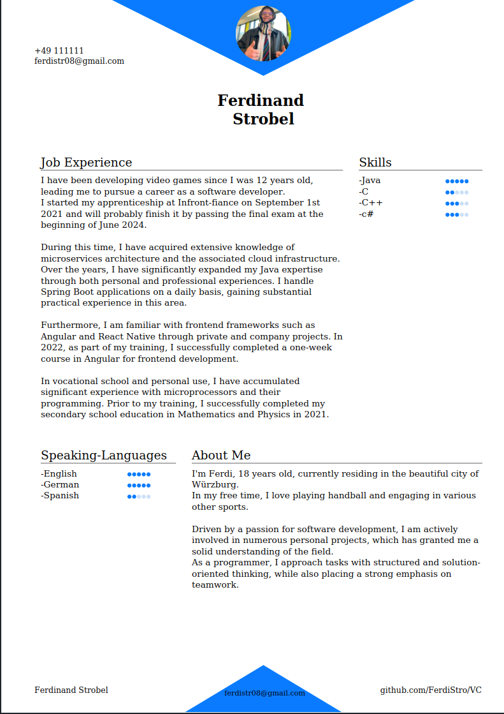
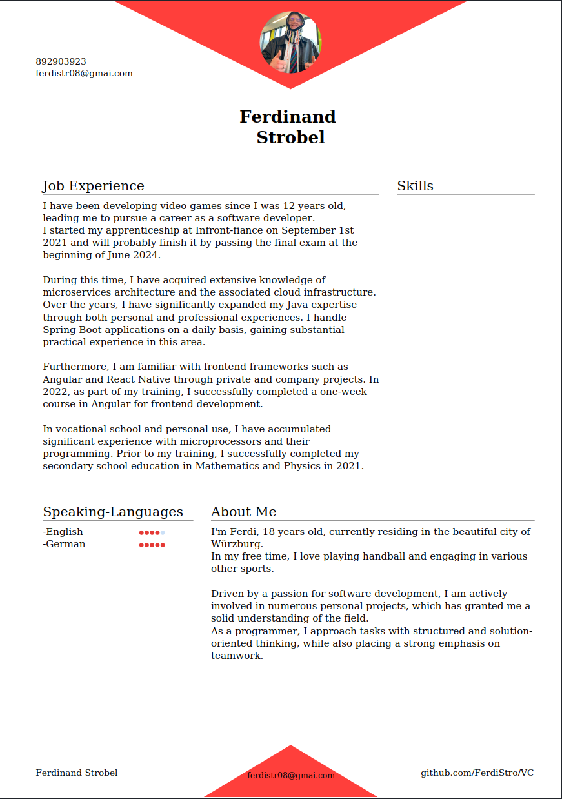

# CV-Generator

This project allows you to create a professional CV tailored to your programming career. To get started, you need to install Rust and Docker Compose.

## Prerequisites

1. Install **Rust**:  
   [Rust Installation Guide](https://www.rust-lang.org/tools/install)

2. Install **Docker Compose**:  
   [Docker Compose Installation Guide](https://docs.docker.com/compose/install/)

## Getting Started

### Running the Project

Once you have Rust and Docker Compose installed, follow these steps to run the project:

1. Clone the repository (if you haven't already).
2. Navigate to the project directory in your terminal.
3. Run the following command to start the guided CLI:

   ```
   cargo run --package grrs --bin grrs
   ```

### Building the CV

After running the project, you can build your CV using Docker Compose. Once the build process completes, a `VC.pdf` file will be generated, which will be your finished CV.

## Examples

Here are some examples of CVs generated by this project:







## Todos
- text edit
- change picture
- add address
- maybe build more modules or frontend