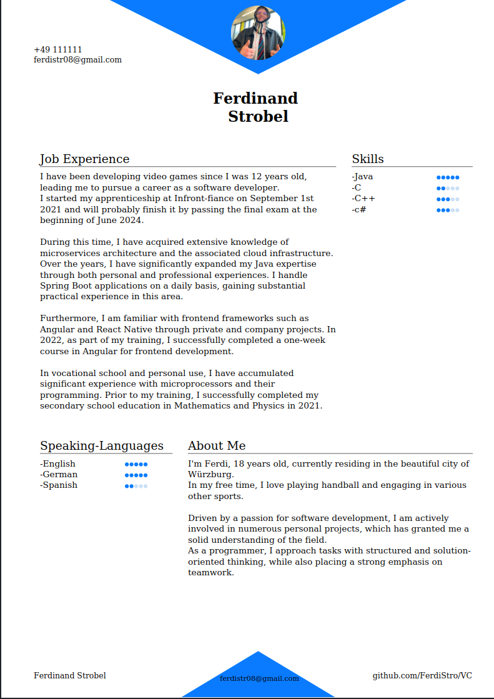
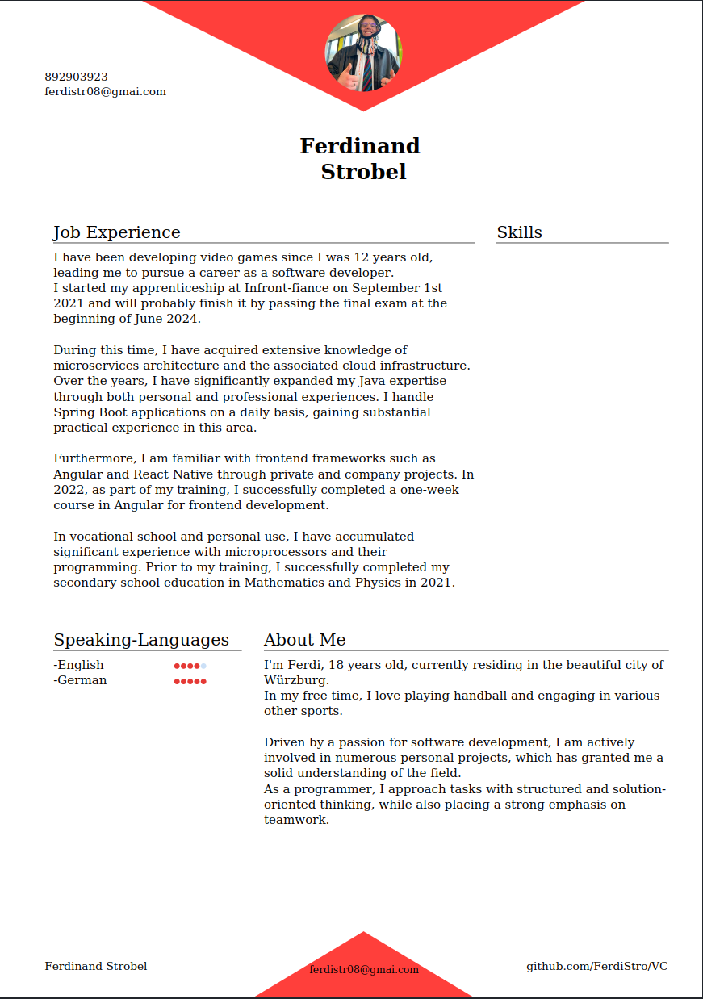
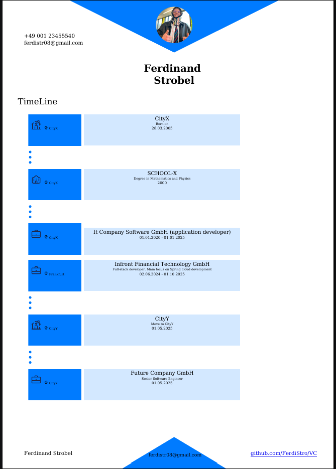

# 📄 CV-Generator

This project helps you create a professional **CV**, **Timelines**, and **Cover Letters** tailored for your programming career. It's built with Rust and uses Docker Compose to generate beautiful PDFs.

---

## 🚀 Prerequisites

Before you begin, make sure the following are installed:

1. **Rust**  
   👉 [Install Rust](https://www.rust-lang.org/tools/install)

2. **Docker Compose**  
   👉 [Install Docker Compose](https://docs.docker.com/compose/install/)

---

## 🛠️ Getting Started

### Option 1: Interactive CLI (Recommended)

1. Clone the repository.
2. Navigate to the project directory.
3. Run the interactive CLI:

```bash
cargo run --package grrs --bin grrs
````

After entering your information, Docker Compose will generate your CV. The result is a `VC.pdf` file.

---

### Option 2: CLI with Flags (Fully Automated)

You can also generate the CV using CLI flags directly (no prompts):

```bash
cargo run -- --cli [additional flags]
```

For help:

```bash
cargo run -- --cli -h
```

---

### 🧩 Available Flags

| Flag                                                                                             | Description                                       |
|--------------------------------------------------------------------------------------------------|---------------------------------------------------|
| `--cli`                                                                                          | Enables CLI flag mode                             |
| `--cover <text>`                                                                                 | Cover letter text (required for cover generation) |
| `--job <name>`                                                                                   | Job title (required when using `--cover`)         |
| `--first_name <name>`                                                                            | Your first name *(required with `--cli`)*         |
| `--last_name <name>`                                                                             | Your last name *(required with `--cli`)*          |
| `--phone_number <number>`                                                                        | Your phone number *(required with `--cli`)*       |
| `--email_address <email>`                                                                        | Your email address *(required with `--cli`)*      |
| `--skill "skill_name=Java,rating=5"`                                                             | Programming skill with rating (repeatable)        |
| `--language "skill_name=English,rating=5"`                                                       | Language with rating (repeatable)                 |
| `--color <hex>`                                                                                  | Accent color of the CV (default: `#007bff`)       |
| `--time_point "type=1,title=Uni,description=Studium,date=2015-2020,location=Munich,space=false"` | Timeline entry (repeatable)                       |
| `--debug`                                                                                        | Enables debug output                              |

📌 Full example:
See [`doc/genereatCV.sh`](doc/genereatCV.sh)

---

## 📸 Examples

### CV Samples




### Timeline Example



---

## 📝 Todo

* [ ] Add manual cover letter generator (`cv_manual.rs`)
* [ ] Improve text formatting
* [ ] Add custom profile picture option
* [ ] Build more modules or a frontend

---


